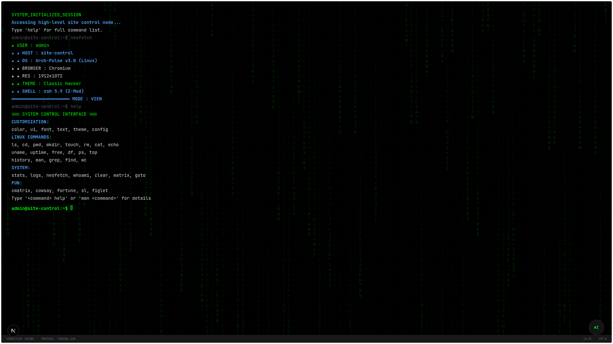

# 📟 Terminal System & System Control v3.0



> **"A computer once beat me at chess, but it was no match for me at kick boxing."**

This is not just a system. It is a fully interactive **Terminal Operating System** running in your browser. Built with **Next.js**, **TypeScript**, and **Three.js**, it bridges the gap between retro aesthetics and modern web performance.

---

## 🚀 Core Capabilities

### 1. 📂 Virtual File System (VFS)
Navigate a persistent, in-memory file system just like a real Linux machine.
- **Commands**: `ls`, `cd`, `pwd`, `mkdir`, `touch`, `rm`, `cat`, `echo`.
- **Features**: Recursive directory listing, file creation, and content viewing.
- **Persistency**: Your changes are saved in local storage.

### 2. 🎨 Advanced Customization
Make the terminal yours. configure every pixel.
- **Themes**: Switch instantly between `dracula`, `monokai`, `cyberpunk`, `retro`, `nord`, and more.
  - usage: `theme preset cyberpunk`
- **UI Control**: Toggle glassmorphism, 3D backgrounds, and font sizes.
  - usage: `ui glass on`, `font size 18`
- **Matrix Effect**: The ultimate hacker aesthetic.
  - usage: `matrix` (or `cmatrix`)

### 3. 🛠️ System Tools & Utilities
Packed with simulated versions of powerful Linux tools.
- **Network**: `ping`, `curl`, `wget` (simulated latency and progress bars).
- **Text Processing**: `grep` (supports regex!), `sort` (reverse sorting), `wc`.
- **System Info**: `uname`, `uptime`, `free`, `df`, `ps`, `top`, `whoami`.
- **Environment**: `which`, `env`.

### 4. 🎲 Fun & Games (Phase 6)
Because terminals should be fun.
- **`cmatrix`**: Full-screen digital rain.
- **`sl`**: Steam Locomotive animation.
- **`cowsay <text>`**: Let a cow speak for you.
- **`fortune`**: Random wisdom from the tech gods.
- **`figlet <text>`**: Big ASCII banners.

### 5. 🧱 Design Mode (New!)
A built-in 3D scene editor.
- **Toggle**: `ui mode edit`
- **Create**: Add 3D cubes, spheres, and planes to the background scene.
- **Edit**: Modify system text (username, prompt) directly in the UI.

---

## ⌨️ Command Reference

| Category | Commands |
| :--- | :--- |
| **Navigation** | `ls`, `cd`, `pwd` |
| **File Ops** | `mkdir`, `touch`, `rm`, `cat`, `echo` |
| **System** | `clear`, `history`, `help`, `exit`, `reboot` |
| **Network** | `ping`, `curl`, `wget` |
| **Text** | `grep`, `sort`, `wc` |
| **Fun** | `matrix`, `cmatrix`, `cowsay`, `fortune`, `sl`, `figlet` |
| **Config** | `theme`, `color`, `font`, `ui`, `text`, `config` |

---

## 💻 Tech Stack

- **Framework**: [Next.js 14](https://nextjs.org/) (App Router)
- **Language**: [TypeScript](https://www.typescriptlang.org/)
- **Styling**: [Tailwind CSS](https://tailwindcss.com/)
- **3D Graphics**: [Three.js](https://threejs.org/) + [React Three Fiber](https://docs.pmnd.rs/react-three-fiber)
- **State**: React Context + LocalStorage
- **Icons**: [Lucide React](https://lucide.dev/)

---

## 🛠️ Installation

1. **Clone & Install**
   ```bash
   git clone https://github.com/devnazarchuk/webterminal.git
   cd webterminal
   npm install
   ```

2. **Run Development Server**
   ```bash
   npm run dev
   ```

3. **Build for Production**
   ```bash
   npm run build
   ```

---

## 👨‍💻 Engineer

**Artem Nazarchuk**
- [GitHub](https://github.com/devnazarchuk)
- [LinkedIn](https://linkedin.com/in/devnazarchuk)

> *System ready. Awaiting input...*
